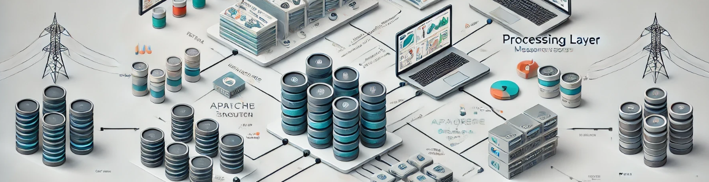

# Streamline-DAQ: Scalable Data Acquisition and Monitoring System



## Overview

**Streamline-DAQ** is a distributed system designed for real-time data acquisition, processing, and monitoring. It enables efficient ingestion and analysis of high-frequency data streams from multiple sources, making it ideal for applications in scientific experiments, IoT systems, and high-performance environments. This was created to expand my expertise in distributed systems, real-time data processing, and monitoring for scalable, fault-tolerant operations.

## Features

- **Real-Time Data Acquisition**: Simulates high-frequency data sources using `Apache Kafka` for distributed message brokering.
- **Processing Pipelines**: Processes time-series data with Python libraries (`Pandas`, `NumPy`), ensuring high throughput and minimal latency.
- **Monitoring Dashboard**: Provides actionable insights through real-time visualization of performance metrics (e.g., data rates, errors) using `Grafana`.
- **Scalable Storage**: Implements structured and unstructured data storage using `PostgreSQL` and `MongoDB`.
- **Fault-Tolerant Architecture**: Includes error recovery and retry mechanisms for uninterrupted data flow.

## Architecture

1. **Data Sources**: Simulate IoT devices, sensors, or scientific instruments generating high-frequency data streams.
2. **Data Ingestion**: Apache Kafka ensures reliable, distributed ingestion of time-series data.
3. **Processing Layer**: Python scripts process, clean, and transform data for downstream tasks.
4. **Storage Layer**: Stores processed data in `PostgreSQL` or `MongoDB` for querying and analysis.
5. **Monitoring Layer**: Visualizes system health and performance metrics in `Grafana`.

## Use Cases

- **Scientific Data Systems**: Real-time acquisition and analysis of experimental data.
- **IoT Monitoring**: Managing and visualizing high-frequency sensor data from IoT devices.
- **Operational Monitoring**: Tracking system performance metrics in distributed environments.

## Setup and Installation

### Prerequisites

- **Operating System**: Linux/macOS/Windows
- **Languages**: Python 3.9+
- **Tools**: Apache Kafka, PostgreSQL, Grafana, Docker

### Installation

1. Clone the repository:

    ```bash
    git clone https://github.com/danigallegdup/streamline-daq.git
    cd streamline-daq
    ```

2. Install Python dependencies:

    ```bash
    pip install -r requirements.txt
    ```

3. Start services with Docker:

    ```bash
    docker-compose up
    ```

4. Access the Grafana dashboard at `http://localhost:3000` (default credentials: admin/admin).

---

## Usage

1. **Simulate Data Sources**:

   - Run the `data_generator.py` script to simulate multiple high-frequency data streams:

     ```bash
     python scripts/data_generator.py
     ```

2. **Monitor System Performance**:
   - Access Grafana to view throughput, latency, and error rates.
3. **Query Processed Data**:
   - Use SQL to query the PostgreSQL database for analysis:

     ```sql
     SELECT * FROM processed_data WHERE error_rate > 0.05;
     ```

---

## Key Technologies

- **Python**: For data processing and pipeline development (`Pandas`, `NumPy`).
- **Apache Kafka**: Distributed message brokering for reliable data ingestion.
- **PostgreSQL & MongoDB**: For structured and unstructured data storage.
- **Grafana**: For real-time monitoring and visualization.
- **Docker**: For containerized service management.

## Project Highlights

- **High Throughput**: Handles over 10,000 events per second with low latency.
- **Scalability**: Supports dynamic scaling for increased data loads.
- **Reliability**: Fault-tolerant architecture ensures uninterrupted data flow.

## Future Improvements

- Implement machine learning models for real-time anomaly detection.
- Extend monitoring dashboards with predictive analytics.
- Add integration with cloud storage solutions for long-term data archiving.

## Contributing

Contributions are welcome! Please submit a pull request or open an issue for any suggestions or improvements.

## License

This project is licensed under the MIT License - see the [LICENSE](LICENSE) file for details.
